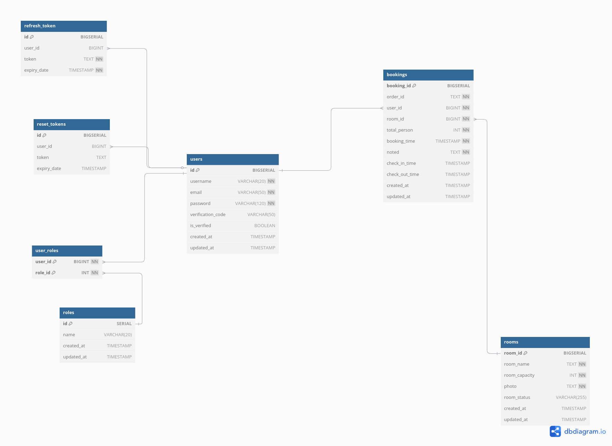
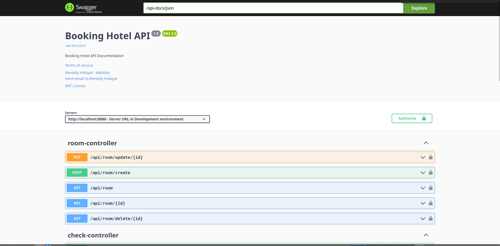

# 🏨 Booking Hotel

**Booking Hotel** is a hotel booking management system that includes user authentication and various related features. This application is built with **Spring Boot** and uses **PostgreSQL** as the main database. The system also provides **OpenAPI** documentation and can be easily deployed in a **Docker** environment.

## ✨ Features

- **Hotel Booking Management** – Users can book hotel rooms with multiple available options.
- **User Authentication** – Supports user registration, login, and account management.
- **API Documentation** – Uses **OpenAPI** for documentation and API exploration.
- **Relational Database** – Stores user and booking data using **PostgreSQL**.
- **Containerized Deployment** – Easily deployable with **Docker**.

## ERD & Swagger

### ERD

### Swagger
